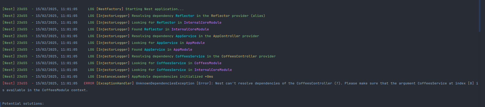

<p align="center">
  <a href="http://nestjs.com/" target="blank"></a>
</p>

[circleci-image]: https://img.shields.io/circleci/build/github/nestjs/nest/master?token=abc123def456
[circleci-url]: https://circleci.com/gh/nestjs/nest

  <p align="center">A progressive <a href="http://nodejs.org" target="_blank">Node.js</a> framework for building efficient and scalable server-side applications.</p>
    <p align="center">
<a href="https://www.npmjs.com/~nestjscore" target="_blank"></a>
<a href="https://www.npmjs.com/~nestjscore" target="_blank"></a>
<a href="https://www.npmjs.com/~nestjscore" target="_blank"></a>
<a href="https://circleci.com/gh/nestjs/nest" target="_blank"></a>
<a href="https://coveralls.io/github/nestjs/nest?branch=master" target="_blank"></a>
<a href="https://discord.gg/G7Qnnhy" target="_blank"></a>
<a href="https://opencollective.com/nest#backer" target="_blank"></a>
<a href="https://opencollective.com/nest#sponsor" target="_blank"></a>
  <a href="https://paypal.me/kamilmysliwiec" target="_blank"></a>
    <a href="https://opencollective.com/nest#sponsor"  target="_blank"></a>
  <a href="https://twitter.com/nestframework" target="_blank"></a>
</p>
  <!--[](https://opencollective.com/nest#backer)
  [](https://opencollective.com/nest#sponsor)-->

## Description

[Nest](https://github.com/nestjs/nest) framework TypeScript starter repository.

## Project setup

```bash
$ pnpm install
```

## Compile and run the project

```bash
# development
$ pnpm run start

# watch mode
$ pnpm run start:dev

# production mode
$ pnpm run start:prod
```

## Run tests

```bash
# unit tests
$ pnpm run test

# e2e tests
$ pnpm run test:e2e

# test coverage
$ pnpm run test:cov
```

## Deployment

When you're ready to deploy your NestJS application to production, there are some key steps you can take to ensure it runs as efficiently as possible. Check out the [deployment documentation](https://docs.nestjs.com/deployment) for more information.

If you are looking for a cloud-based platform to deploy your NestJS application, check out [Mau](https://mau.nestjs.com), our official platform for deploying NestJS applications on AWS. Mau makes deployment straightforward and fast, requiring just a few simple steps:

```bash
$ pnpm install -g mau
$ mau deploy
```

With Mau, you can deploy your application in just a few clicks, allowing you to focus on building features rather than managing infrastructure.

## Resources

Check out a few resources that may come in handy when working with NestJS:

- Visit the [NestJS Documentation](https://docs.nestjs.com) to learn more about the framework.
- For questions and support, please visit our [Discord channel](https://discord.gg/G7Qnnhy).
- To dive deeper and get more hands-on experience, check out our official video [courses](https://courses.nestjs.com/).
- Deploy your application to AWS with the help of [NestJS Mau](https://mau.nestjs.com) in just a few clicks.
- Visualize your application graph and interact with the NestJS application in real-time using [NestJS Devtools](https://devtools.nestjs.com).
- Need help with your project (part-time to full-time)? Check out our official [enterprise support](https://enterprise.nestjs.com).
- To stay in the loop and get updates, follow us on [X](https://x.com/nestframework) and [LinkedIn](https://linkedin.com/company/nestjs).
- Looking for a job, or have a job to offer? Check out our official [Jobs board](https://jobs.nestjs.com).

## Support

Nest is an MIT-licensed open source project. It can grow thanks to the sponsors and support by the amazing backers. If you'd like to join them, please [read more here](https://docs.nestjs.com/support).

## Stay in touch

- Author - [Kamil Myśliwiec](https://twitter.com/kammysliwiec)
- Website - [https://nestjs.com](https://nestjs.com/)
- Twitter - [@nestframework](https://twitter.com/nestframework)

## License

Nest is [MIT licensed](https://github.com/nestjs/nest/blob/master/LICENSE).


### STUDY


PRA RODAR O DEBUG DO NEST
A cor em amarelo encontrada em nosso terminal é a classe hospedeira da dependência
a de azul e o nome da dependencia do injection token
a roxa e o modulo que foi procurado

```bash
NEST_DEBUG=true pnpm run start:dev
```



//pra verficiar depenndeica circular

```bash
npx madge dist/main.js --circular
```


```bash
npx madge dist/main.js --image graph.png
```


//PRA skipar o module
```bash
// ⚙️ Generate a new "rewards" module:
nest g mo rewards --skip-import
// ⚙️ Generate a single RewardsService within that module:
nest g s rewards/rewards --skip-import
```


```ts
// ⚙️ Terminal - generate blank schematic using npx
npx @angular-devkit/schematics-cli blank --name=schematics
/** Note: we're going to use npx here, 
 *  but note that alternatively - you could install the "@angular-devkit/schematics-cli" package globally 
 *  and refer to it as "schematics" instead of using npx - if you prefer.
 **/

// 🏗 Install required dev dependency
npm i @schematics/angular -D

// 🏗 Build the app in "watch" mode
npm run build -- --watch

// ⚙️ Terminal - TO EXECUTE THE SCHEMATIC (when you are ready)
npx @angular-devkit/schematics-cli ./schematics:configurable-module
// NOTE: --debug=false (needed to actually "run" it), it is debug=true by default

// ----------
// 📝 FINAL - schematics collections.json
{
  "$schema": "../node_modules/@angular-devkit/schematics/collection-schema.json",
  "schematics": {
    "configurable-module": {
      "description": "Generates a configurable module.",
      "factory": "./configurable-module/index#generate",
      "schema": "./configurable-module/schema.json"
    }
  }
}


// ----------
// 📝 FINAL - index.ts (configurable-module)
import { dasherize } from '@angular-devkit/core/src/utils/strings';
import {
  apply,
  chain,
  externalSchematic,
  mergeWith,
  move,
  Rule,
  SchematicContext,
  strings,
  template,
  Tree,
  url,
} from '@angular-devkit/schematics';
import * as ts from '@schematics/angular/third_party/github.com/Microsoft/TypeScript/lib/typescript';
import { findNodes, insertImport } from '@schematics/angular/utility/ast-utils';
import { InsertChange } from '@schematics/angular/utility/change';

interface ConfigurableModuleSchematicOptions {
  name: string;
}

function updateModuleFile(
  tree: Tree,
  options: ConfigurableModuleSchematicOptions,
): Tree {
  const name = dasherize(options.name);
  const moduleFilePath = `src/${name}/${name}.module.ts`;
  const moduleFileContent = tree.readText(moduleFilePath);
  const source = ts.createSourceFile(
    moduleFilePath,
    moduleFileContent,
    ts.ScriptTarget.Latest, // use the latest TypeScript version
    true,
  );
  const updateRecorder = tree.beginUpdate(moduleFilePath);
  const insertImportChange = insertImport(
    source,
    moduleFilePath,
    'ConfigurableModuleClass',
    `./${name}.module-definition`,
  );
  if (insertImportChange instanceof InsertChange) {
    updateRecorder.insertRight(
      insertImportChange.pos,
      insertImportChange.toAdd,
    );
  }
  const classNode = findNodes(source, ts.SyntaxKind.ClassDeclaration)[0];
  updateRecorder.insertRight(
    classNode.end - 2,
    'extends ConfigurableModuleClass ',
  );
  tree.commitUpdate(updateRecorder);

  return tree;
}

// You don't have to export the function as default. You can also have more than one rule factory
// per file.
export function generate(options: ConfigurableModuleSchematicOptions): Rule {
  return (_tree: Tree, _context: SchematicContext) => {
    const templateSource = apply(url('./files'), [
      template({ ...options, ...strings }),
      move('src'),
    ]);

    return chain([
      externalSchematic('@nestjs/schematics', 'module', {
        name: options.name,
      }),
      mergeWith(templateSource),
      (tree) => updateModuleFile(tree, options),
    ]);
  };
}

// ----------
// 📝 FINAL - files / __name@dasherize__.module-definition.ts
import { ConfigurableModuleBuilder } from '@nestjs/common';

export const { ConfigurableModuleClass } =
  new ConfigurableModuleBuilder().build();

// ----------
// 📝 FINAL - schema.json
{
  "$schema": "http://json-schema.org/schema",
  "$id": "configurable-module",
  "type": "object",
  "properties": {
    "name": {
      "type": "string",
      "description": "The name of the module.",
      "$default": {
        "$source": "argv",
        "index": 0
      },
      "x-prompt": "What name would you like to use for the module?"
    }
  },
  "required": ["name"]
}
```